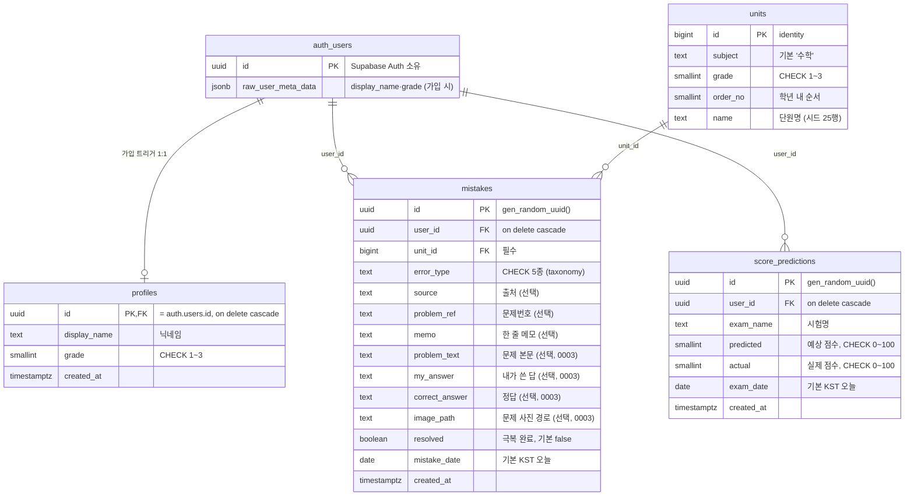
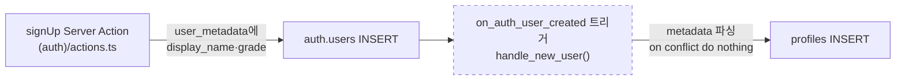
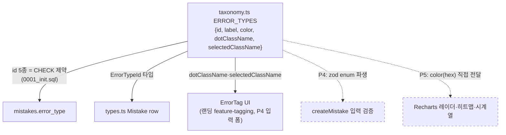
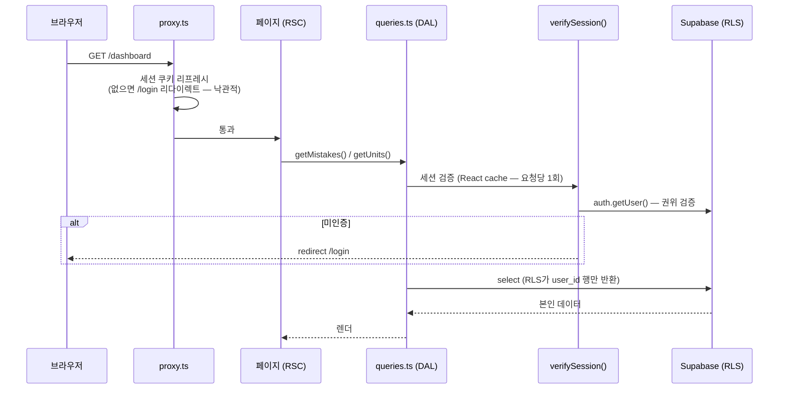

# MetaNote 데이터 구조 (SCHEMA.md)

> 코드가 진실, 이 문서는 지도다. 스키마를 바꾸면 이 문서도 같이 갱신한다.
> 소스: [supabase/migrations/0001_init.sql](../supabase/migrations/0001_init.sql) · [0003_mistake_detail.sql](../supabase/migrations/0003_mistake_detail.sql) · [src/lib/taxonomy.ts](../src/lib/taxonomy.ts) · [src/lib/types.ts](../src/lib/types.ts) · [src/lib/queries.ts](../src/lib/queries.ts)

## ER 다이어그램

`auth.users`는 Supabase Auth 소유(외부), 나머지 4개가 `public` 스키마다.
학생별 데이터(mistakes/score_predictions/profiles)는 전부 `user_id → auth.users` FK + RLS로 격리되고, `units`만 전역 읽기 전용 마스터다.

- `units(subject, grade, order_no)`는 UNIQUE — 시드가 이 키로 upsert된다.
- `score_predictions`의 `predicted`/`actual`은 둘 다 nullable — 시험 전엔 예상만, 시험 후 실제를 채우는 시나리오 3 흐름 때문이다. 착각점수 = `actual - predicted` (둘 다 있을 때만, Phase 5에서 계산).
- 인덱스: `mistakes(user_id, created_at desc)`(목록·시계열), `mistakes(user_id, unit_id)`(히트맵 집계·FK 겸용), `score_predictions(user_id, exam_date desc)`.

## RLS 정책 요약

모든 테이블 RLS 활성. 조건은 행마다 함수 호출을 피하는 `(select auth.uid())` 패턴, 대상 롤은 전부 `authenticated`.

| 테이블 | 정책 | 커맨드 | 조건 |
|---|---|---|---|
| `profiles` | 본인 프로필 조회 | SELECT | `(select auth.uid()) = id` |
| `profiles` | 본인 프로필 수정 | UPDATE | 〃 (using + with check) |
| `units` | 단원 조회 | SELECT | `true` — 전역 read-only, 쓰기 정책 없음 |
| `mistakes` | 본인 오답만 접근 | ALL | `(select auth.uid()) = user_id` (using + with check) |
| `score_predictions` | 본인 점수 기록만 접근 | ALL | 〃 |

`profiles`에 INSERT 정책이 없는 것은 의도다 — 생성은 아래 가입 트리거만 담당한다.
격리 검증: [e2e/rls.spec.ts](../e2e/rls.spec.ts) (`db` 프로젝트, 계정 A↔B 교차 접근 시도).

## Storage — mistake-images (문제 사진)

비공개 버킷 하나 ([0003](../supabase/migrations/0003_mistake_detail.sql)). 10MB 제한, 이미지 mime만 허용.

- **경로 규칙**: `{user_id}/{uuid}.jpg` — `mistakes.image_path`가 이 경로를 가리킨다.
- **storage.objects 정책** (전부 `authenticated`, 조건은 `bucket_id = 'mistake-images' and (storage.foldername(name))[1] = (select auth.uid())::text`): SELECT / INSERT / DELETE 3개. UPDATE 정책은 의도적으로 없음 — 사진 교체는 새 업로드 + 옛 객체 삭제.
- **업로드 흐름**: 브라우저에서 canvas 압축(최대 변 1600px, JPEG 0.8) 후 supabase-js로 직접 업로드 ([mistake-image.ts](../src/lib/mistake-image.ts)) → 서버 액션에는 경로 문자열만 전달 (파일 바이트가 서버 액션 body limit을 타지 않는다). 서버는 `{uid}/` prefix를 재검증.
- **표시 흐름**: DAL의 `getMistakeImageUrl()`이 1시간짜리 signed URL 발급 → 상세 페이지 ``. 요청마다 재서명하므로 만료 문제 없음.
- **정리**: 오답 삭제·사진 교체·저장 실패 롤백 시 옛 객체를 베스트에포트로 remove. 남은 고아 객체는 비공개 버킷이라 노출되지 않는다.

## 가입 시 프로필 생성 흐름

- `handle_new_user()`는 `security definer` + `set search_path = ''`. RPC 노출을 막기 위해 `anon`/`authenticated`의 EXECUTE는 회수됨 ([0002](../supabase/migrations/0002_revoke_handle_new_user.sql)).
- Phase 1에서 user_metadata에만 저장된 기존 계정은 0001 마이그레이션이 일괄 백필했다.

## taxonomy — 오류 유형 5종의 단일 소스

Newman 단순화 5종 (`misread`/`no_concept`/`calc_error`/`careless`/`time_pressure`).
[src/lib/taxonomy.ts](../src/lib/taxonomy.ts)의 `ERROR_TYPES`가 유일한 정의이고, 나머지는 전부 파생이다.

- DB CHECK와 `ERROR_TYPE_IDS`가 어긋나면 [taxonomy.test.ts](../src/lib/taxonomy.test.ts)와 [rls.spec.ts](../e2e/rls.spec.ts)(미정의 유형 insert 거부)가 잡는다.
- `color`가 Tailwind 클래스와 별도로 hex를 갖는 이유: Recharts SVG는 CSS 변수를 못 읽는다.
- green(`#1aae39`)은 극복 완료 전용, brown은 일러스트 전용 — 오류 유형 색이 아니다 (DESIGN.md 규칙).
- 유형 추가/변경 절차: `ERROR_TYPES` 수정 → 테스트의 `EXPECTED` 갱신 → DB CHECK 제약 마이그레이션 → 끝 (UI·차트는 자동 반영).

## 데이터 접근 흐름

라우트는 supabase를 직접 부르지 않고 항상 DAL([queries.ts](../src/lib/queries.ts))을 거친다.
proxy는 낙관적 리다이렉트·세션 갱신만, 권위 있는 인증 검증은 DAL의 `verifySession()`이 담당한다 (Next 공식 auth 가이드 패턴).

- `getUnits()`/`getMistakes()`는 React `cache()`로 감싸 한 요청 안에서 중복 호출돼도 1회만 나간다.
- 뮤테이션(P4~)은 Server Actions + `revalidatePath` — fetch 캐시는 쓰지 않는다 (전 데이터가 학생별 쿠키 스코프).

## 단원 시드 (2022 개정 교육과정 중학 수학)

| 학년 | 단원 수 | 범위 |
|---|---|---|
| 1학년 | 9 | 소인수분해 ~ 대푯값과 자료의 정리 |
| 2학년 | 9 | 유리수와 순환소수 ~ 경우의 수와 확률 |
| 3학년 | 7 | 제곱근과 실수 ~ 산포도와 상관관계 |

전체 25행은 [0001_init.sql](../supabase/migrations/0001_init.sql)의 시드 참조. 2022 개정에서 대푯값이 중1로, 확률이 중2로 이동한 것이 반영돼 있다.
